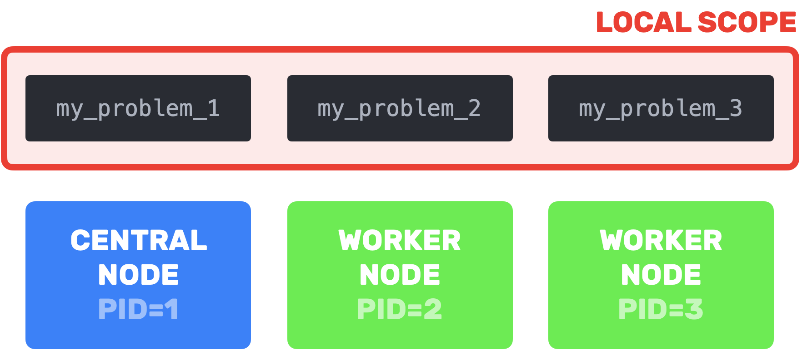
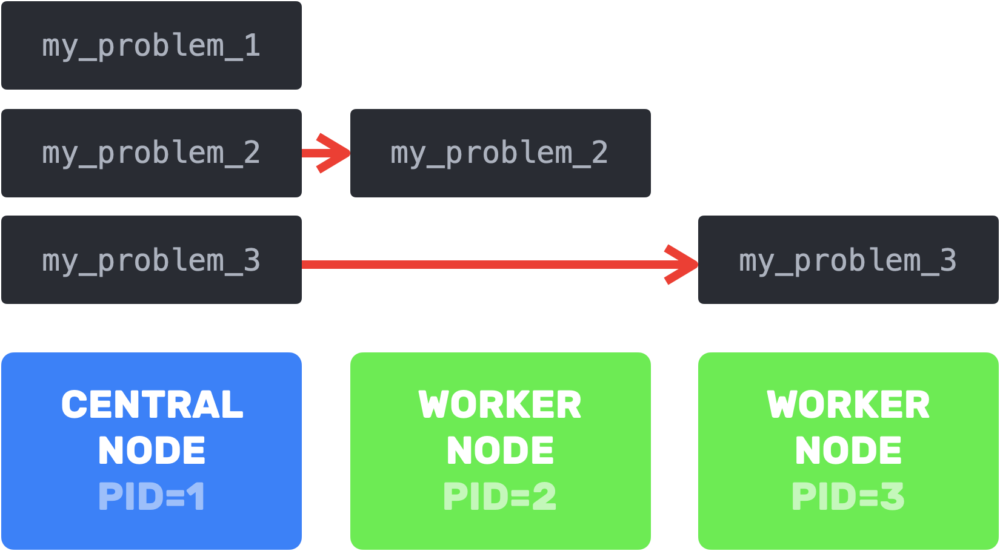

# Manual

We saw how to run an asynchronous version of the SGD algorithm on a LRMSE problem in [quick start](@ref quick_start). Here we'll use this same example to look at the following:  

  - [Working with a distributed problem](@ref)
  - [Synchronous run](@ref)
  - [Active processes](@ref)
  - [Recording iterates](@ref recording_iterated)
  - [Customization of `start`'s execution](@ref custom_execution)
  - [Handling worker failures](@ref)
  - [Algorithm wrappers](@ref algorithm_wrappers)

## Working with a distributed problem

Suppose you have a `make_problem` function

```julia
# Note: In this example, we sample `A` and `b`. 
# In practice, we could read them from a file or any other source.
@everywhere function make_problem(pid)
    pid==1 && return nothing # for now, let's assign process 1 an empty problem
    LRMSE(rand(pid,10),rand(pid)) # the sample size is `m` is set to `pid` for demonstration purposes only
end
```

When instantiating your problems you might have three requirements:

- **Limiting communication costs** and **avoiding duplicated memory**: loading problems directly on their assigned processes is preferable to loading them central node before sending them to their respective processes
- **Persistent data**: necessary if you want to reuse problems for multiple experiments (you don't want your problems to be stuck on  remote processes in `start`'s local scope)

Depending on your needs, you have three options to construct your problems:

```julia
# Option 1: Instantiate the problems remotely
problem_constructor = make_problem 

# Option 2: Instantiate the problems on the central node and send them to their respective processes
problems = Dict(procs() .=> make_problem.(procs()));
problem_constructor = (pid) -> problems[pid]

# Option 3: Create a `DistributedObject` that references a problem on each process. 
@everywhere using DistributedObjects
distributed_problem = DistributedObject((pid) -> make_problem(pid), pids=procs())
```
> Option 3 uses [`DistributedObjects`](https://github.com/Selim78/DistributedObjects.jl). In a nutshell, a `DistributedObject` instance references at most one object per process, and you can access the object stored on the current process with `[]`


|  | communication costs & duplicated memory 	| single use objectives 	|  	|
|---	|:---:	|:---:	|---	|
| Option 1 	|  	| ❌ 	|  	|
| Option 2 	| ❌ 	|  	|  	|
| Option 3 	|  	|  	|  	|

As previously noted, Option 2 should be avoided when working with large data. However, it does offer the advantage of preserving access to problems, which is not possible with Option 1. This opens up the possibility of reconstructing the global problem.

```julia
# reconstructing global problem from problems stored locally
function LRMSE(problems::Dict)
    pids = [pid for pid in keys(problems) if pid ≠ 1]
    n = problems[pids[1]].n
    m = sum([problems[pid].m for pid in pids])
    L = sum([problems[pid].L for pid in pids])
    ∇f(x) = sum([problems[pid].∇f(x) * problems[pid].m for pid in pids]) / m
    return LRMSE(nothing,nothing,n,m,L,∇f)
end

problems[1] = LRMSE(problems);
# We now have access to the global Lipschitz constant!
sgd = SGD(1/problems[1].L)
```

*Option 3* is the best of both worlds:

```julia
# reconstructing global problem from problems stored remotely 
function LRMSE(d::DistributedObject)
    pids = [pid for pid in where(d) if pid ≠ 1]
    n = fetch(@spawnat pids[1] d[].n)
    m = sum(fetch.([@spawnat pid d[].m for pid in pids]))
    L = sum(fetch.([@spawnat pid d[].L for pid in pids]))
    ∇f(x) = sum(fetch.([@spawnat pid d[].∇f(x) * d[].m for pid in pids])) / m
    return LRMSE(nothing,nothing,n,m,L,∇f)
end

distributed_problem[] = LRMSE(distributed_problem);
# We also have access to the global Lipschitz constant!
sgd = SGD(1/distributed_problem[].L)
```

It's worth mentioning that instead of `problem_constructor::Function`, `distributed_problem::DistributedObject` can be passed to [`start`](@ref). Both of the following are equivalent:

```julia
history = start(sgd, (pid)-> distributed_problem[], stopat)
history = start(sgd, distributed_problem, stopat);
```

## Synchronous run

If you want to run your algorithm synchronously you just have to define the **synchronous central step** performed by the central node when receiving answers `as::Vector{A}` from all the `workers`...

```julia
@everywhere begin
    # synchronous central step
    (sgd::SGD)(as::Vector{Vector{Float64}}, workers::Vector{Int64}, problem::Any) = sum(as)
end
```

...and to add the `synchronous=true` keyword to [`start`](@ref)

```julia
history = start(sgd, distributed_problem, stopat; synchronous=true);
```

## Active processes

You can choose which processes are active with the `pids` keyword

```julia
history = start(sgd, problem_constructor, stopat; pids=[2,3,6]);
```

If `pids=[1]`, a non-distributed (and necessarily synchronous) version of your algorithm will be `start`ed.

```julia
history = start(sgd, (pid)->LRMSE(rand(42,10),rand(42)), stopat; pids=[1], synchronous=true);
```

## [Recording iterates](@id recording_iterated)

The queries`::Q` sent by the central node, along with the iterations, epochs, times at wich they were recorded, are saved at intervals specified by the keyword `saveat`: every `iteration` and every `epoch` (see [`savenow`](@ref) for custom saving criteria).

You can set any or all criteria: `saveat=(iteration=100, epoch=10)` or `saveat=(epoch=100,)` for example.

To also save the workers' answers`::A`, simply add the `save_answers=true` keyword (see [`savevalues`](@ref) and [`report`](@ref) to save additional variables during execution).

```julia
history = start(sgd, distributed_problem, stopat; saveat=(iteration=100, epoch=10), save_answers=true);
```

## [Customization of `start`'s execution](@id custom_execution)

Let's look at a slightly modified version of `SGD` where we track the *"precision"* of our iterative algorithm, measured as the distance between the last two iterates.

```julia
@everywhere begin
    using LinearAlgebra

    mutable struct SGDbis<:AbstractAlgorithm{Vector{Float64},Vector{Float64}}
        stepsize::Float64
        previous_q::Vector{Float64}
        precision::Float64  # will hold the distance between the last two iterates
        precisions::Vector{Float64} # record of all the precisions 
        SGDbis(stepsize::Float64) = new(stepsize, Vector{Float64}(), Inf, Vector{Float64}())
    end
    
    # no changes
    function (sgd::SGDbis)(problem::Any)
        sgd.previous_q = rand(problem.n)
    end
    
    # no changes
    function (sgd::SGDbis)(q::Vector{Float64}, problem::Any)
        sgd.stepsize * problem.∇f(q, rand(1:problem.m))
    end
    
    function (sgd::SGDbis)(a::Vector{Float64}, worker::Int64, problem::Any) 
        q = sgd.previous_q - a 
        sgd.precision = norm(q-sgd.previous_q)
        sgd.previous_q = q
    end
end
```

> Recall that we defined `const AIA = AsynchronousIterativeAlgorithms`

### [`stopnow`](@ref)

By default, you can specify the any of following stopping criteria through the `stopat` argument: maximum `iteration`, `epoch` and `time`. If any is met, the execution is stopped.

If you require additional stopping conditions, for instance *"stop at current iteration if the precision is below a threshold"* you can define [`stopnow`](@ref) on your algorithm:

```julia
function AIA.stopnow(sgd::SGDbis, stopat::NamedTuple) 
    haskey(stopat, :precision) ? sgd.precision ≤ stopat.precision : false
end
```

You can now set `stopat` to `(iteration=1000, precision=1e-5)` or `(precision=1e-5,)` for example.

### [`savenow`](@ref)

By default, you can specify intervals at which [some parameters](@ref recording_iterated) are recorded through the `saveat` keyword: every `iteration` and every `epoch`.

If you require additional saving checkpoints, for instance *"save current iteration if is below a threshold"*, you can define [`savenow`](@ref) on your algorithm:

```julia
function AIA.savenow(sgd::SGDbis, saveat::NamedTuple) 
    haskey(saveat, :precision) ? sgd.precision ≤ saveat.precision : false 
end
```

You can now set `saveat` to `(precision=1e-4, time=42)` or just `(precision=1e-4,)` for example.

### [`savevalues`](@ref)

[By default](@ref recording_iterated), at each `saveat` checkpoint, only queries, iterations, epochs, times, answer count per worker and optionally answers and their provenance.

If you want to record other values, for instance the precisions computed at the `saveat` checkpoints, you can define [`savevalues`](@ref) on your algorithm:

```julia
function AIA.savevalues(sgd::SGDbis) 
    sgd.precisions = append!(sgd.precisions, [sgd.precision])
end
```

### [`report`](@ref)

To retrieve any values held by your algorithm, for example the precisions, return them as a `NamedTuple` in [`report`](@ref):

```julia
function AIA.report(sgd::SGDbis)
    (precisions = sgd.precisions,)
end
```

They will now be outputted by [`start`](@ref).

### [`progress`](@ref)

When `verbose>1` a progress bar is displayed. To reflect any progress other than the number of iterations, epochs, and the time, return a value between `0` to `1` (`1` meaning completion) in [`progress`](@ref):

```julia
function AIA.progress(sgd::SGDbis, stopat::NamedTuple) 
    if haskey(stopat, :precision) 
        sgd.precision == 0 && return 1.
        return stopat.precision / sgd.precision
    else 
        return 0.
    end
end
```

### [`showvalues`](@ref)

Below the progress bar, by default, the number of iterations, epochs and answers-per-worker count are displayed. If you want to keep track of other values, return them as a `Vector` of `Tuple{Symbol,Any}` in [`savevalues`](@ref):

```julia
function AIA.showvalues(sgd::SGDbis)
    [(:precision, round(sgd.precision; sigdigits=4))]
end
```

## Handling worker failures

If you expect some workers to fail but still want the algorithm to continue running, you can set the `resilience` parameter to the maximum number of worker failures you can tolerate before the execution is terminated.

## [Algorithm wrappers](@id algorithm_wrappers)

You are free to create your own algorithms, but if you're interested in *aggregation algorithms*, you can use an implementation provided in this library. The iteration of such an algorithm performs the following computation:

$$q_j \longleftarrow \textrm{query}(\underset{i \in \textrm{connected}}{\textrm{aggregate}}(a_j))\ \ \textrm{where }\ \ a_i = \textrm{answer}(q_i)$$

where $q_j$ is computed by the worker upon reception of $\textrm{answer}(q_i)$ from worker $j$ and where $connected$ are the list of workers that have answered.

The [`AggregationAlgorithm`](@ref) in this library requires you to define four methods: `initialize`, `query`, `answer`, and `aggregate`. Here's an example showing the required signatures of these three methods:

```julia
@everywhere begin 
    using Statistics

    struct ToBeAggregatedGD <: AbstractAlgorithm{Vector{Float64},Vector{Float64}}
        q1::Vector{Float64}
        stepsize::Float64 
    end

    AIA.initialize(tba::ToBeAggregatedGD, problem::Any) = tba.q1
    AIA.aggregate(tba::ToBeAggregatedGD, a::Vector{Vector{Float64}}, connected::Vector{Int64}) = mean(a)            
    AIA.query(tba::ToBeAggregatedGD, a::Vector{Float64}, problem::Any) = a
    AIA.answer(tba::ToBeAggregatedGD, q::Vector{Float64}, problem::Any) = q - tba.stepsize * problem.∇f(q)
end 

algorithm = AggregationAlgorithm(ToBeAggregatedGD(rand(10), 0.01); pids=workers())

history = start(algorithm, distributed_problem, (epoch=100,));
```

**Memory limitation:** At any point in time, the central worker should have access must have access to the latest answers $a_i$ from *all* the connected workers. This means storing a lot of $a_i$ if we use many workers. There is a workaround when the aggregation operation is an *average*. In this case, only the equivalent of one answer needs to be saved on the central node, regardless of the number of workers.

[`AveragingAlgorithm`](@ref) implements this memory optimization. Here you only need to define `initialize`, `query`, the `answer`

```julia
@everywhere begin 
    struct ToBeAveragedGD <: AbstractAlgorithm{Vector{Float64},Vector{Float64}}
        q1::Vector{Float64}
        stepsize::Float64 
    end

    AIA.initialize(tba::ToBeAveragedGD, problem::Any) = tba.q1
    AIA.query(tba::ToBeAveragedGD, a::Vector{Float64}, problem::Any) = a
    AIA.answer(tba::ToBeAveragedGD, q::Vector{Float64}, problem::Any) = q - tba.stepsize * problem.∇f(q)
end 

algorithm = AveragingAlgorithm(ToBeAveragedGD(rand(10), 0.01); pids=workers(), weights=ones(nworkers()))

history = start(algorithm, distributed_problem, (epoch=100,));
```

Note that you can implement the [custom callbacks](@ref custom_execution) on both these algorithms by defining them on your algorithm:

```julia
report(::ToBeAggregatedGD) = # do something
```

---

Wow you read all this! Hope you find this library helpful and look forward to seeing how you put it to use!
